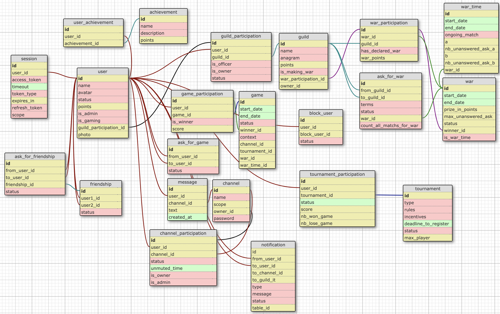

# 42 last mandatory project
- project name: ft_transcendence
- [movie reference : Transcendence (2014)](https://en.wikipedia.org/wiki/Transcendence_(2014_film))
- summary: *"ft_transcendence is a project on a language you should have never worked with. With a framework that you should have never heard of. To do something that you’ve never done before. Remind yourself of the beginning of your journey in computer science. Now look where you are standing. Time to shine"*

# 1. usage

```
docker-compose up --build
```

# 2. some readings 

### Docker
- install https://docs.docker.com/compose/install/
- YT playlist (fr) https://www.youtube.com/playlist?list=PLn6POgpklwWqaC1pdx02SrrgOaL2ZL7G0
- clean all with ```docker system prune --all --volumes``` https://docs.docker.com/engine/reference/commandline/system_prune/

### set up Rails on Docker
- nice article https://www.codewithjason.com/dockerize-rails-application/ 
- Compose and Rails https://docs.docker.com/compose/rails/
- Conteneurisation (fr) https://www.digitalocean.com/community/tutorials/containerizing-a-ruby-on-rails-application-for-development-with-docker-compose-fr
- Compose and Rails https://firehydrant.io/blog/developing-a-ruby-on-rails-app-with-docker-compose/
- Compose and Rails https://thoughtbot.com/blog/rails-on-docker
- nice tuto p1 https://www.youtube.com/watch?v=vn27fUbOLbg
- nice tuto p2 https://www.youtube.com/watch?v=a7eMsiTwhvk

### Ruby - the language
- handling exceptions https://www.synbioz.com/blog/tech/du-bon-usage-des-exceptions-en-ruby
- models associations https://guides.rubyonrails.org/association_basics.html

### Ruby On Rails - the framework
- Full doc https://guides.rubyonrails.org/index.html
- Rails Cheat Sheet: Create Models, Tables and Migrations https://www.ralfebert.de/snippets/ruby-rails/models-tables-migrations-cheat-sheet/?utm_source=lewagon.com
- destroy scaffold https://stackoverflow.com/questions/21487817/rails-destroy-scaffold-leaves-back-table
- ActiveRecords https://guides.rubyonrails.org/active_record_basics.html
- @variables https://stackoverflow.com/questions/14319347/variables-in-ruby-on-rails
- @variables in details http://strugglingwithruby.blogspot.com/2010/03/variables.html
- excellent article: "understanding Webpacker in Rails 6" https://prathamesh.tech/2019/08/26/understanding-webpacker-in-rails-6/
- partial name start with '_' https://stackoverflow.com/questions/25353108/why-do-partials-in-rails-start-with-an-underscore
- Devise & omniauth https://www.youtube.com/watch?v=rIGPVEAeA6M
- types of variables for rails models https://stackoverflow.com/questions/3260345/list-of-rails-model-types
- rails routes https://api.rubyonrails.org/v5.2.1/classes/ActionDispatch/Routing/Mapper/Resources.html
- select & pluck https://medium.com/@amliving/activerecords-select-pluck-3d5c58872053
- application controller https://stackoverflow.com/questions/45340321/what-properties-and-methods-does-an-application-controller-have
- ActionCable
  - full doc https://guides.rubyonrails.org/action_cable_overview.html
  - action cable basics in Rails 6 https://www.youtube.com/watch?v=t9iubpbqmnM
- call another controller action https://stackoverflow.com/questions/5767222/rails-call-another-controller-action-from-a-controller
- rake db:[cmd] https://stackoverflow.com/questions/10301794/difference-between-rake-dbmigrate-dbreset-and-dbschemaload
- cookies https://api.rubyonrails.org/classes/ActionDispatch/Cookies.html
- on the importance of association tables https://stackoverflow.com/questions/11600928/when-to-use-a-has-many-through-relation-in-rails
- return json https://stackoverflow.com/questions/25074631/converting-activerecord-results-to-json-in-transaction-script
- js fast reloading to avoid webpacker compiling https://stackoverflow.com/questions/52281821/webpacker-in-rails-5-takes-a-long-time-to-compile-not-that-many-files-how-can-i
- issue related to js fast reloading https://github.com/webpack/webpack-dev-server/issues/416
- 70+ Ruby on Rails Security Best Practices & Vulnerabilities https://hixonrails.com/ruby-on-rails-tutorials/ruby-on-rails-security-best-practices/?utm_source=lewagon.com
- about schema and data migrations https://boringrails.com/articles/rails-database-migrations-strategy-how-to-manage-migrations-without-losing-your-mind/
- class macros https://pragmaticstudio.com/tutorials/ruby-macros?utm_source=lewagon.com
- upload remote file from url with ActiveStorage Rails https://blog.eq8.eu/til/upload-remote-file-from-url-with-activestorage-rails.html?utm_source=lewagon.com
- about image hosting https://medium.com/@nicolas.lizop/displaying-random-images-on-a-rails-website-with-picsum-unsplash-and-cloudinary-842e026181be
- cloudinary sdk https://cloudinary.com/documentation/rails_integration
- why rails still relevant https://devbrett.com/2019/03/why-i-believe-rails-is-still-relevant-in-2019.html?utm_source=lewagon.com
- find vs find by vs where https://stackoverflow.com/questions/11161663/find-vs-find-by-vs-where
- download file from url https://stackoverflow.com/questions/2515931/how-can-i-download-a-file-from-a-url-and-save-it-in-rails
- cloudinary https://github.com/cloudinary/cloudinary_gem
- open param image in controller https://api.rubyonrails.org/v4.2.5/classes/ActionDispatch/Request.html
- get public url after cloudinary upload https://stackoverflow.com/questions/36200818/get-cloudinary-image-url
- server side validations https://guides.rubyonrails.org/active_record_validations.html#working-with-validation-errors
- background job with active job https://edgeguides.rubyonrails.org/active_job_basics.html
- call controller_a.method from controller_b https://stackoverflow.com/questions/5767222/rails-call-another-controller-action-from-a-controller
- OPP https://stackoverflow.com/questions/42164276/rails-private-vs-protected
- test controller method in console https://stackoverflow.com/questions/10670360/calling-an-applicationcontroller-method-from-console-in-rails
- 2 reference on the same model https://stackoverflow.com/questions/2057210/ruby-on-rails-reference-the-same-model-twice
- call model method with ajax https://stackoverflow.com/questions/27471914/rails-call-model-methods-with-ajax
- merge to active record results https://stackoverflow.com/questions/21876590/merge-two-active-record-results

### Javascript - the language
- DOM, interactions avec le DOM et code asynchrone https://openclassrooms.com/fr/courses/5543061-ecrivez-du-javascript-pour-le-web
- ActionCable https://medium.com/@jelaniwoods/get-started-with-action-cable-in-rails-6-4c605f93c9b8
- confirm() https://stackoverflow.com/questions/6384251/intercepting-a-jquery-ajax-call-with-confirm
- fetch() vs ajax request https://blog.nathanaelcherrier.com/fr/fetch-fin-jquery-ajax/
- fetch https://developer.mozilla.org/fr/docs/Web/API/WindowOrWorkerGlobalScope/fetch
- fileReader() https://developer.mozilla.org/fr/docs/Web/API/FileReader
- jquery events https://developer.mozilla.org/fr/docs/Web/API/Element
- cloudinary js https://cloudinary.com/documentation/javascript_integration#overview
- handling success/error messages after actions https://sweetalert2.github.io/#examples
- iterating over object key/value pairs https://stackoverflow.com/questions/684672/how-do-i-loop-through-or-enumerate-a-javascript-object
- listen if user quit web page https://stackoverflow.com/questions/147636/best-way-to-detect-when-a-user-leaves-a-web-page

### Backbone.js - the framework (library ?)
- all stuff https://backbonejs.org/
- fundamentals https://backbone-fundamentals.readthedocs.io/en/latest/
- YT playlist https://www.youtube.com/watch?v=mBKL7BU6axo&list=PLsk5Jy2ZkiLUP6KbXNDwNSZ1-MXsnt4An
- Débuter avec Backbone.js https://www.synbioz.com/blog/tech/debuter-avec-backbonejs
- a library, not a framework http://nicholasjohnson.com/backbone-book/
- events catalog https://backbonejs.org/#Events-catalog
- todo https://github.com/tastejs/todomvc/tree/master/examples/backbone/js
- views https://solvemprobler.com/blog/2013/04/07/backbone-tips-rendering-views-and-their-childviews/

### Rails w/ Backbone.js 
- backbone on rails https://github.com/jashkenas/backbone/wiki/Tutorials%2C-blog-posts-and-example-sites#screencasts-and-presentation-videos
- [outdated] ~~hands-on Backbone.js on Rails https://thoughtbot.com/upcase/hands-on-backbone-js-on-rails~~
- [outdated] ~~[Backbone on Rails Part 1 https://www.youtube.com/watch?v=lRuBxG7rTX4~~
- [outdated] ~~[Backbone on Rails Part 2 https://www.youtube.com/watch?v=98oUGEz_y4g~~
- seems ok https://github.com/thoughtbot/backbone-js-on-rails/blob/master/book/rails_integration/connecting_rails_and_backbone.md
- understand relations between backbone and rails https://github.com/thoughtbot/backbone-js-on-rails/blob/master/book/rails_integration/connecting_rails_and_backbone.md
- auth with devise and backbone https://stackoverflow.com/questions/24544793/authentication-with-devise-rails-using-backbone
- auth with devise and backbone https://blog.andrewray.me/how-to-set-up-devise-ajax-authentication-with-rails-4-0/

### 42 API
- all stuff https://api.intra.42.fr/apidoc
- OAuth flow https://api.intra.42.fr/apidoc/guides/web_application_flow
- OAuth2 ruby https://github.com/oauth-xx/oauth2
- wtf is refresh token https://zestedesavoir.com/articles/1616/comprendre-oauth-2-0-par-lexemple/#:~:text=Token%20de%20rafra%C3%AEchissement%20%3A%20Refresh%20token,que%20celui%2Dci%20a%20expir%C3%A9.&text=Son%20utilisation%20permet%20au%20client,propri%C3%A9taire%20de%20la%20ressource%20prot%C3%A9g%C3%A9e.
- rails status code mapping http://www.railsstatuscodes.com/
- how to login https://stackoverflow.com/questions/549/the-definitive-guide-to-form-based-website-authentication/477578#477578
- gold tips https://stackoverflow.com/questions/2057210/ruby-on-rails-reference-the-same-model-twice
- call model method with ajax https://stackoverflow.com/questions/27471914/rails-call-model-methods-with-ajax

### Two-factors auth
- tuto https://en.wikipedia.org/wiki/One-time_password#:~:text=A%20one%2Dtime%20password%20(OTP,system%20or%20other%20digital%20device.
- git https://github.com/heapsource/active_model_otp
- qrcode https://github.com/heapsource/active_model_otp/wiki/Generate-QR-code-with-rqrcode-gem

### CSS
- A Complete Guide to Flexbox https://css-tricks.com/snippets/css/a-guide-to-flexbox/
- Bootstrap https://getbootstrap.com/docs/4.5/components/forms/
- override boostrap https://stackoverflow.com/questions/44449372/override-bootstrap-important
- vh vw https://stackoverflow.com/questions/1575141/how-to-make-a-div-100-height-of-the-browser-window
- flex-grow https://developer.mozilla.org/fr/docs/Web/CSS/flex-grow

# 3. Utils

### Formating

- http response to json https://jsonformatter.curiousconcept.com/#
- url decoder https://www.urldecoder.io/
- vs code extensions https://medium.com/better-programming/vs-code-extensions-for-ruby-on-rails-developers-917474e03e04
- get postgresql version https://makandracards.com/makandra/42104-rails-how-to-get-postgresql-version-being-used

### Database postgresql schema

work in progress



